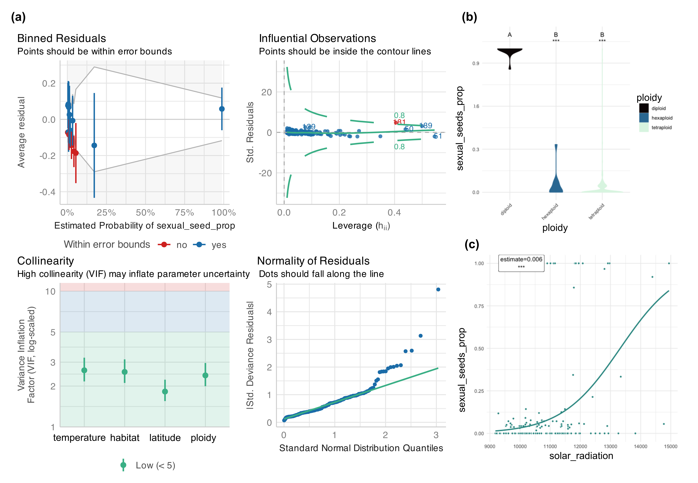

# LazyModeler

`LazyModeler` is a statistical package for the programming language R that allows users to easily perform regression modeling. It includes removal of autocorrelated variables, choice between several types of (non)linear regression models, standard stepwise model simplification, various model quality checks, plotting of coefficient estimates and relationships, and output generation.

# Overview and major functions

`LazyModeler` automatizes all necessary steps needed for use of (non)linear regression models. It comprises three major functions that are included within the main function `optimize_model`.

The first major function `remove_autocorrelations` checks for any autocorrelations (\|r\| \> 0.7) [@Dormann2013] given a list of variables sorted by relevance. Automatic removal of these autocorrelations is possible through the use of a function parameter. Removal will follow the order of the list of variables, ensuring that the user's expertise on the importance of features is respected. A named list is returned with a) a vector containing all removed predictors, and b) a dataframe listing autocorrelations and information on deleted variables.

The main function provides the model formula to the second major function `simplify_model`. If autocorrelations were detected, the formula is updated accordingly. The regression model is then calculated. Options for the models are: `lm`, `glm`, `lmer`, `glmer`, `gam`, or `nlmer`, with all possible distributions of the response variable being allowed. Stepwise backward simplification or forward model selection takes place using an iterative process where each time the metric(s) specified by the user are applied on the model to check whether further simplification/selection is needed. Main variables are kept when they are involved in interactions. Options for the metrics are: `aov`, `aic`, `aicc`, or `bic`. The final model is returned to the main function alongside its metadata as well as simplification history if requested by the user.

Using the third major function `fancy_plotting`, the final model then undergoes multiple visualization steps. Plots to assess model quality are created using the standard plot function available through base R, or model check included in the `performance` R package [@Luedecke2021]. Furthermore, the script produces regression, box, or violin plots for each numerical or categorical coefficient as well as plots depicting effects sizes and estimates. All generated plots are returned to the user within a named list. The main function additionally returns the output of both the model simplification/selection and autocorrelation functions as well as the summary of the final model.

`LazyModeler` makes use of the R package `corrplot` [@Wei2021] to calculate correlations between variables, `lme4` [@Bates2024] for regression modeling, `tidyverse` [@Wickham2019] for data handling, and `spind` [@Carl2018] for calculation of AICc scores. For generation of plots visualizing regression, effect size, and estimates, the script further leverages `tidyverse` and color palettes included in the `colorspace` [@Zeileis2020] and `viridis` [@Garnier2024] R packages.

# Example

``` r

# import example data
data(plants)

# check data structure
str(plants)
summary(plants)

# testing dataset (subset) based on Karbstein et al. 2021
#(https://onlinelibrary.wiley.com/doi/10.1111/mec.15919)

results_example <- optimize_model(plants, quote(sexual_seed_prop ~
altitude + latitude_gps_n + longitude_gps_e + (solar_radiation +
annual_mean_temperature + isothermality)^2 + I(isothermality^2) +
habitat + ploidy),  autocorrelation_cols = c("solar_radiation",
"annual_mean_temperature", "isothermality", "altitude",
"latitude_gps_n", "longitude_gps_e"), automatic_removal=TRUE,
autocorrelation_threshold = 0.8, correlation_method="spearman",
model_type = "glm", model_family = "quasibinomial",
assessment_methods=c("anova"), simplification_direction="backward",
omit.na="overall", scale_predictor=TRUE,
plot_quality_assessment="performance", round_p=3,
cor_use="complete.obs", plot_relationships=TRUE, jitter_plots=TRUE,
plot_type="violinplot",  stat_test="wilcox",
backward_simplify_model=TRUE, trace=TRUE)
```



