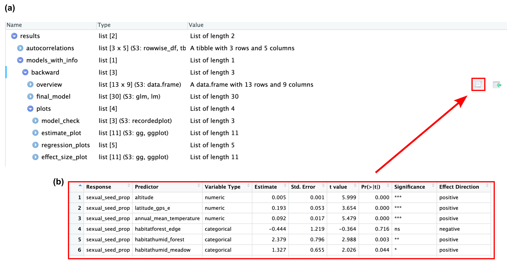
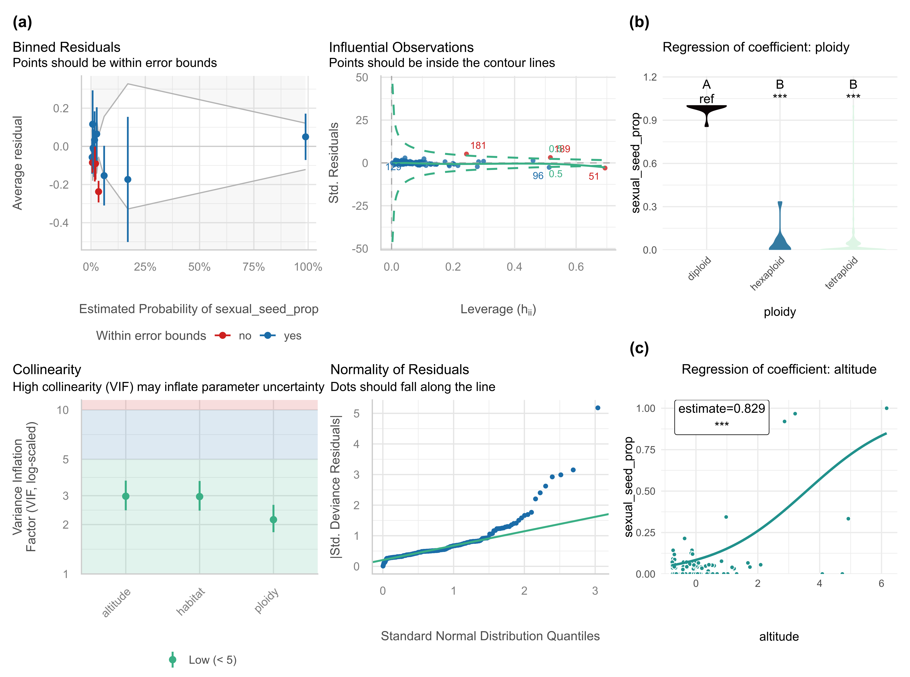

# Summary

Setting up, simplifying, checking, and visualizing regression models continues to be a time-consuming task involving multiple, sometimes concurrent, workflows and software packages. This particularly applies to big data research where several models with different response variables and many explanatory variables need to be set up and optimized. To tackle this problem, we present `LazyModeler` - a statistical package for the programming language R that allows to easily perform regression modeling. It includes removal of autocorrelated variables, choice between several types of (non)linear regression models, standard stepwise model simplification, various model quality checks, plotting of coefficient estimates and relationships, and output generation. `LazyModeler` will significantly speed up regression modeling, enabling people to analyze and illustrate their data in a statistically reliable and standardized manner.

# Statement of need

Statistical modeling describes the process of finding a mathematical function with specific statistical assumptions that best fits the observed data [@Crawley2007; @Crawley2015; @Henley2020]. This process attempts, in practice, to find a (causal) relationship between a dependent response variable `y` and an independent predictor variable `x` for any postulated hypothesis. For statistical inference and graphics in science, the programming environment R [@RCoreTeam2024] has become highly popular.

Linear models, as one of the most basic and powerful tools, have been frequently applied in this context [@Crawley2007; @Crawley2015; @Schielzeth2020; @Li2023]. Because of their flexibility, they also allow for non-normally distributed response variables (e.g., in the case of binomial, proportional, or count data), and any kind of transformation for numerical (e.g., polynomial or logarithmic) and categorical (e.g., centered or one-hot/fractional encoded) predictor variables, as well as interactions among them [@Cai2023; @Roemermann2016; @Henley2020; @Karbstein2019; @Karbstein2020; @Karbstein2021; @Liaw2021; @Schielzeth2010]. Regression models also provide the ability to control for random effects that may influence the variables of interest [e.g., @Bauer2020; @Wicke2016; @Schielzeth2020]. Although other statistical technologies can outperform them in highly complex, non-linear scenarios, regression models allow for detailed variable transformation and interaction, mathematical formula specification, calculation of effect sizes, determination of variable significance, and thus hypothesis testing and explanation [@Benjamin2018; @Bzdok2019; @Schulz2020; @Cai2023; @Karbstein2023; @Li2023]. Recent developments make regression models also applicable to nonlinear scenarios [e.g., @Bates2024; @Hastie2023]. Consequently, they are of high practical value in finding and interpreting significant relationships.

In statistical modeling, and especially in real-world applications, multiple predictors are assumed for a given response variable. As a consequence, people strive to exclude the irrelevant from the relevant (statistically significant) information, which is called model simplification [@Crawley2007; @Forstmeier2011; @Crawley2015]. One of the most widely used optimization workflows is stepwise model simplification. For example, starting from a full/saturated model, the least significant variable (p\>0.05) is excluded until the final minimal adequate model is attained ['backward simplification'; @Crawley2007; @Forstmeier2011; @Crawley2015]. Each model simplification step will be justified with certain metrics (e.g., SSE, AIC, or BIC) [@Henley2020]. Given the number of models, variables of interest, and their data characteristics, this task can be extraordinarily time consuming. Currently, only AIC/BIC-based automated simplification is available [e.g., 'stepAIC', @Venables2002]. Nevertheless, model simplification continuous to be a rather manual process [on GoogleScholar, only ca. 5,000 "stepAIC" entries despite ca. 5,000,000 "linear regression model" studies (0.1%); e.g., @Roemermann2016; @Karbstein2019; @Henley2020; @Karbstein2020; @Cai2023; @Li2023]. In addition, simplification and other aspects such as data cleaning, model comparison and quality control, and output visualization have not been automated. An easy-to-use, all-in-one function for the entire modeling process within a single software package is missing.

Our R package `LazyModeler` addresses these issues by automating variable selection, model optimization, and output illustration and generation. In detail, users will be enabled to automatically remove autocorrelated variables, choose between several types of (non)linear regression models (e.g., LM, GLM, LMER, GLMER, GAM, or NLMER), perform stepwise model simplification, check model quality, plot coefficient estimates and relationships, and generate the output of the final model.

# Overview and major functions

`LazyModeler` automatizes all necessary steps needed for use of (non)linear regression models. It comprises three major functions that are included within the main function `optimize_model`.

The first major function `remove_autocorrelations` checks for any autocorrelations (\|r\| \> 0.7) [@Dormann2013] given a list of variables sorted by relevance. Automatic removal of these autocorrelations is possible through the use of a function parameter. Removal will follow the order of the list of variables, ensuring that the user's expertise on the importance of features is respected. A named list is returned with a) a vector containing all removed predictors, and b) a dataframe listing autocorrelations and information on deleted variables.

The main function provides the model formula to the second major function `simplify_model`. If autocorrelations were detected, the formula is updated accordingly. The regression model is then calculated. Options for the models are: `lm`, `glm`, `lmer`, `glmer`, `gam`, or `nlmer`, with all possible distributions of the response variable being allowed. Stepwise backward simplification or forward model selection takes place using an iterative process where each time the metric(s) specified by the user are applied on the model to check whether further simplification/selection is needed. Main variables are kept when they are involved in interactions. Options for the metrics are: `aov`, `aic`, `aicc`, or `bic`. The final model is returned to the main function alongside its metadata as well as simplification history if requested by the user.

Using the third major function `plot_model_features`, the final model then undergoes multiple visualization steps. Plots to assess model quality are created using the standard plot function available through base R, or model check included in the `performance` R package [@Luedecke2021]. Furthermore, the script produces regression, box, or violin plots for each numerical or categorical coefficient as well as plots depicting effects sizes and estimates. All generated plots are returned to the user within a named list. The main function additionally returns the output of both the model simplification/selection and autocorrelation functions as well as the summary of the final model.

`LazyModeler` makes use of the R package `corrplot` [@Wei2021] to calculate correlations between variables, `lme4` [@Bates2024] and `lmerTest` [@Kuznetsova2017] for regression modeling, `tidyverse` [@Wickham2019] for data handling, and `MuMIn` [@Barton2024] for calculation of AICc scores. For generation of plots visualizing regression, effect size, and estimates, the script further leverages `tidyverse` and color palettes included in the `colorspace` [@Zeileis2020] and `viridis` [@Garnier2024] R packages.

# Example

``` r

# import example data
data(plants)

# check data structure
str(plants)
summary(plants)

# testing dataset (subset) based on Karbstein et al. 2021
#(https://onlinelibrary.wiley.com/doi/10.1111/mec.15919)

results_example <- optimize_model(plants, quote(sexual_seed_prop ~
altitude + latitude_gps_n + longitude_gps_e + (solar_radiation +
annual_mean_temperature + isothermality)^2 + I(isothermality^2) +
habitat + ploidy),  autocorrelation_cols = c("solar_radiation",
"annual_mean_temperature", "isothermality", "altitude",
"latitude_gps_n", "longitude_gps_e"), automatic_removal=TRUE,
autocorrelation_threshold = 0.8, correlation_method="spearman",
model_type = "glm", model_family = "quasibinomial",
assessment_methods=c("anova"), simplification_direction="backward",
omit.na="overall", scale_predictor=TRUE,
plot_quality_assessment="performance", round_p=3,
cor_use="complete.obs", plot_relationships=TRUE, jitter_plots=TRUE,
plot_type="violinplot",  stat_test="wilcox",
backward_simplify_model=TRUE, trace=TRUE)
```





# Conclusions

In summary, `LazyModeler` streamlines the process of building, simplifying, and visualizing regression models in R. By automating key steps such as autocorrelation removal, model selection, quality assessment, and output generation, it significantly reduces manual effort. The package is especially valuable for researchers dealing with large and complex datasets who seek a reproducible and statistically sound regression modeling workflow. We anticipate that `LazyModeler` will serve as a practical and accessible tool for both novice and experienced users in the scientific community.

\newpage

# Code Availability

The code including basic documentation and an exemplary testing dataset will be made available upon publication on [Github](https://github.com/LMKoesters/LazyModeler) and on [Comprehensive R Archive Network (CRAN)](https://cran.r-project.org).

# Acknowledgements

We acknowledge financial support from the German Federal Ministry of Education and Research (BMBF) grant 01IS20062.

# References
